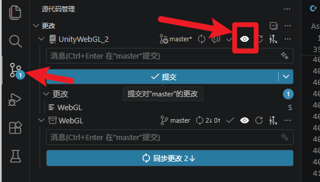

# 评审直达

`评审直达` 是一个 Visual Studio Code 扩展，用于在 VS Code 的源代码管理（SCM）界面为每个 Git 仓库添加一个 “Push for Review” 按钮，便于将当前分支推送到 Gerrit 风格的评审分支（`refs/for/<branch>`）。

## 主要功能（面向用户）

- 在每个 Git 仓库的 SCM 页面添加“Push for Review”按钮。
- 自动检测当前分支并将其推送到 `refs/for/<branch>`。
- 捕获远端返回信息并尝试识别评审链接；可配置是否在推送后自动打开链接。
- 在 macOS 上支持系统通知（需要允许 VS Code 的通知权限）。

## 快速使用

1. 打开需要操作的仓库并切换到源代码管理（SCM）视图。
2. 在对应仓库的标题栏点击“Push for Review”按钮。
3. 推送完成后会弹出结果对话框（成功 / 失败），如果检测到评审链接并且在设置中启用了自动跳转，则会在默认浏览器中打开链接。

### 设置示例（用户可在 VS Code 的设置中修改）

在 `settings.json` 中的示例：

```json
"reviewStream.autoOpenLink": true,
"reviewStream.urlMappings": [
	{
		"pattern": "gerrit3\\.alibaba-inc\\.com",
		"url": "https://banma-scm.yunos-inc.com/buildCenter/task/prebuild/add"
	}
]
```

- `reviewStream.autoOpenLink`（布尔，默认 `true`）：是否在推送后自动打开识别到的评审链接。
- `reviewStream.urlMappings`（对象数组）：可配置的正则->URL 映射列表；当返回文本或消息匹配 `pattern` 时，将自动打开对应的 `url`（若 `autoOpenLink` 为 `true`）。

## 使用演示与截图

-  
- SCM 中显示“Push for Review”按钮的示意图

## 常见用户级问题

- 我不想自动打开链接怎么办？
	- 请在设置中将 `reviewStream.autoOpenLink` 设为 `false`。

- 如何添加自定义的正则->URL 映射？
	- 在 `reviewStream.urlMappings` 中添加对象形如 `{ "pattern": "your-regex", "url": "https://example.com/path" }`。

## 想了解如何开发或构建此扩展？

开发者相关的安装、编译、打包与测试说明已移入开发者文档： [DEVELOPMENT.md](DEVELOPMENT.md)

## 参考

更多实现细节请查看源代码： [src/extension.ts](src/extension.ts)

